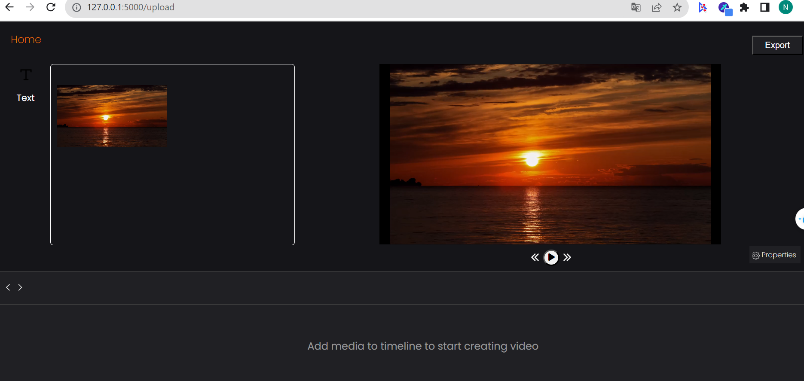

# UPLOAD VIDEO
# Download and Installation
 - For Python 3.9: https://www.python.org/downloads/release/python-397/
 - Make sure to install moviepy first: pip install moviepy
 - Install Flask: pip install flask
# Install environment
 - virtualenv env

# Usage
 - Run file app.py: flask run
 - First, click on the file selection button to upload the required video

 - Click upload to switch to the video editing page
 
 - Next, drag the video into the editing pane
 
- You can press the play button, pause the video, fast forward and rewind the video
 
- Click the text button to add text to the video in the editing frame
 
- You can delete the newly added text
 
- Finally, click the export button to export the video. After exporting, it will display successfully
 